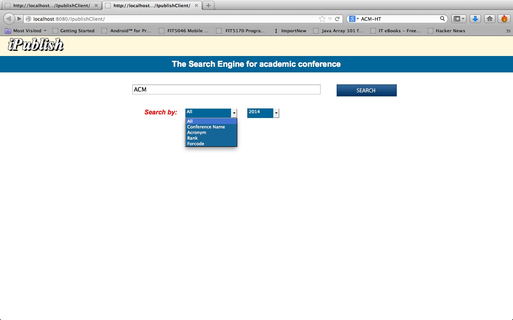

ipublish-client
===============

Ipublish is an web application that enable Computer Science academics who frequently, or occasionally, publish to search for a particular conference and receive useful and relevant information/results in a well-organized layout and user friendly GUI of the web application. 
The page1 is the homepage. In tis page, users can search conference by four types: Title, Acronym, Rank, Forcode and All. You can search the conference info by year as well (default is current year). When click “search ” button. It will jump to the page2. If the keyword user typed in search bar match at least one record, the page2 only show the record info from database, otherwise, page2 will shows some relevant info from Google search and twitter. After user got the record from database, they can click them and look for more detail information about this conference. Those information will shows in page3.  Page3 has three parts:
•	The conference information in database
•	The Google custom search result for this conference, which including: the conference starts date, end date, submits dateline, location and so one. The location is just available for current year.  If the result shows the location, this application will give user more detail information about this location such as the picture of the location and some description. 
•	The relevant tweets about this conference.  This application enables to analysis those tweets and calculates the percentage of the positive, negative and neutral tweets. The sentiment analysis result will shows as a pie chat. 

